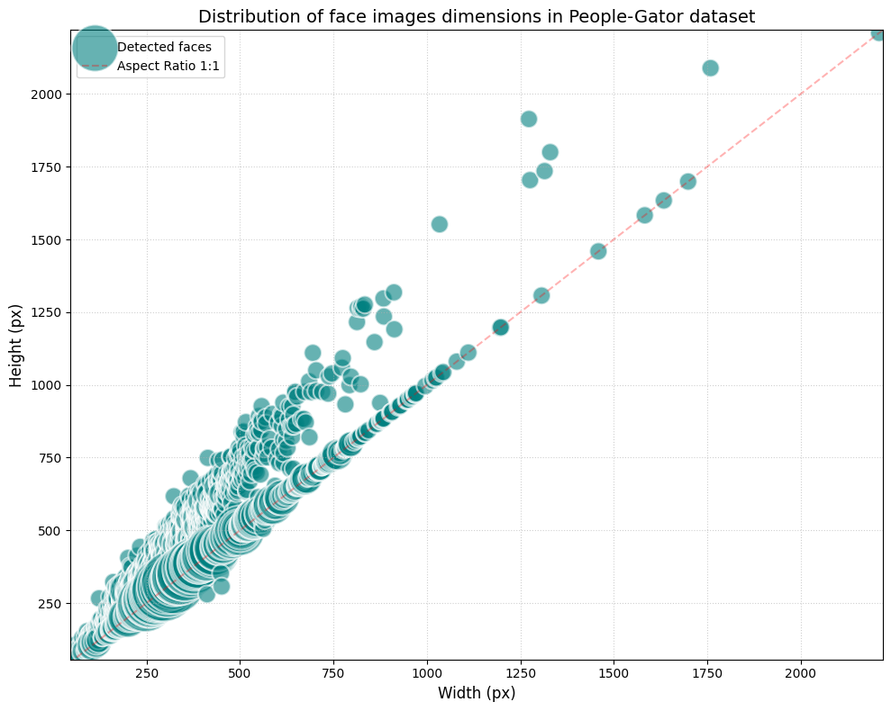

# Neural Face Identifier – Project Proposal

Authors: Richard Kocián (xkocia19), Karel Srna (xsrnak00), Tomáš Zgút (xzgutt00)

## Problem Description

The goal of this project is to develop and fine-tune a deep learning model capable of robust face identification within
scanned historical documents, such as books and newspapers. Unlike standard face recognition datasets, historical scans
present unique challenges: low resolution, halftone printing artifacts (dithering), compression noise, and varying
lighting conditions typical for digitized archives.

We aim to bridge the domain gap between modern high-quality digital photography and the specific visual characteristics
of scanned print media to allow for reliable person identification across large-scale digital libraries.

## Related Work & Inspiration

### Vision Transformer (ViT-S/8)

We utilize the ViT-S/8 architecture, which processes images as sequences of 8x8 pixel patches. We use a backbone
pre-trained on the MS1MV3 dataset to leverage robust facial representations learned from millions of identities.

HuggingFace: https://huggingface.co/gaunernst/vit_small_patch8_gap_112.cosface_ms1mv3

### CosFace (Large Margin Cosine Loss)

For fine-tuning, we will use CosFace. This loss function normalizes both features and weights to project them onto a
hypersphere, introducing a cosine margin (m) in the angular space. This explicitly minimizes intra-class variance (
keeping images of the same person together) and maximizes inter-class variance (pushing different identities apart),
significantly improving discriminative power in noisy domains.

Paper: https://arxiv.org/abs/1801.09414

## Datasets

- MS1MV3: A cleaned version of the MS-Celeb-1M dataset. This serves as the source for our pre-trained backbone (
  ViT-S/8).

- "Newspaper Dataset" (People-Gator): A specialized dataset provided by the mentor containing face detections from
  scanned (historical) magazines. This will be our primary training and fine-tuning set.

- WikiFace (wiki_face_112_fin): Also provided by the mentor, will be used as an additional evaluation benchmark to test
  the generalization of our model on non-newspaper but related data

### Dataset Statistics

| Dataset          | Identities | Images    | Resolution | Role                      | Size    |
|:-----------------|:-----------|:----------|:-----------|:--------------------------|:--------|
| **MS1MV3**       | 93,431     | 5,179,510 | 112x112 px | Pre-training & Evaluation | 29 GB   |
| **People-Gator** | 589        | 30,700    | See Fig. 1 | Fine-tuning & Evaluation  | 6,62 GB |
| **WikiFace**     | 1,537      | 3,223     | 112x112 px | Evaluation                | 10,1 MB |

Fig. 1: Distribution of face detection resolutions in the People-Gator dataset:

## Proposed Solution & Plan

We will adopt a transfer learning strategy. Instead of training from scratch, we will adapt a high-performance
transformer-based extractor to the specific domain of scanned documents.

1. Data Pipeline: Transformation and preprocessing of the "Newspaper Dataset" into a format suitable for the PyTorch
   training loop.

2. Backbone: Selection of a pre-trained ViT-S/8 (GAP) architecture.

3. Fine-tuning: Training the model using the CosFace loss function on the People-Gator dataset. We will experiment with
   different freezing strategies (keeping the backbone frozen vs. full fine-tuning) to prevent catastrophic forgetting
   of facial features.

4. Domain Adaptation (Optional): If time permits, we will apply synthetic degradations (noise, blurring, halftone
   filters) to subsets of WebFace260M or/and other datasets to further augment the training data and improve robustness
   against scanning artifacts.

### Experiments & Evaluation Metrics

We will quantitatively evaluate the impact of fine-tuning on the following scenarios:

| Experiment      | Model                 | Training Data | Evaluation Dataset  |
|:----------------|:----------------------|:--------------|:--------------------|
| **Baseline 1**  | ViT-S/8 (Pre-trained) | MS1MV3        | People-Gator (Test) |
| **Baseline 2**  | ViT-S/8 (Pre-trained) | MS1MV3        | WikiFace            |
| **Finetuned 1** | ViT-S/8 (Ours)        | People-Gator  | People-Gator (Test) |
| **Finetuned 2** | ViT-S/8 (Ours)        | People-Gator  | WikiFace            |

## Source Code Repository

🔗 [https://github.com/richardkocian/neural-face-identifier](https://github.com/richardkocian/neural-face-identifier)
